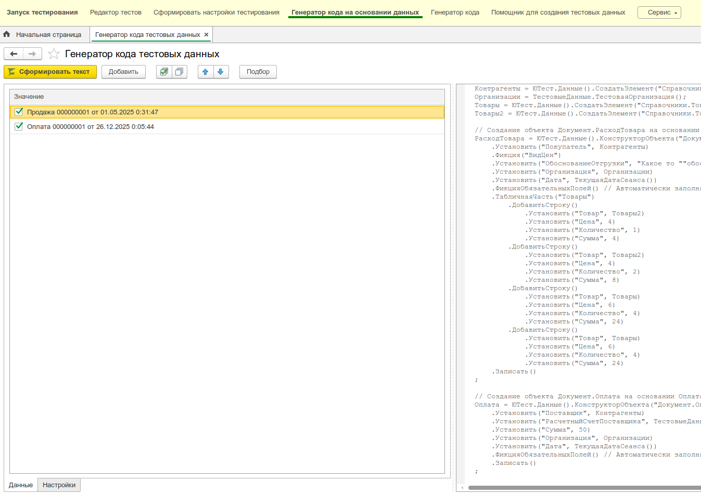
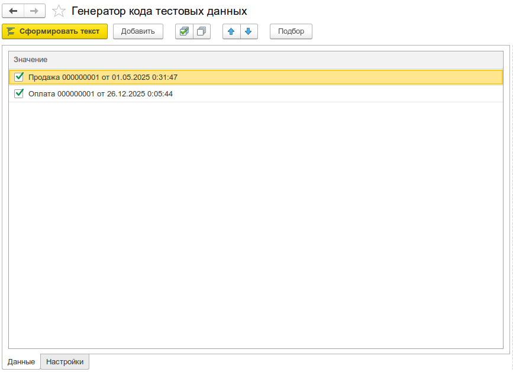

# Генератор кода тестовых данных

Обработка **Генератор кода тестовых данных** позволяет автоматически формировать код на языке 1С для создания тестовых объектов на основе существующих данных в информационной базе.

:::note
Создан по мотивам обработок от сообщества ["Генератор кода"](./object-builder-generator.md) и "Помощник для создания тестовых данных"
:::

## Назначение

Кодогенерация решает следующие задачи:

* **Быстрое создание тестовых данных** - автоматически формирует код для создания объектов со всеми заполненными реквизитами и табличными частями
* **Решение проблемы "чистого листа"** - помогает начать работу с тестами, генерируя базовый код, который можно доработать
* **Создание связанных объектов** - автоматически определяет зависимости между объектами и формирует код в правильном порядке
* **Переиспользование ссылок** - создает переменные для объектов, которые используются несколько раз

## Интерфейс обработки

Обработка состоит из двух основных частей:



### Страница "Данные"

На этой странице отображается таблица объектов, для которых можно сгенерировать код:

* **Пометка** - флажок для выбора объектов, которые будут включены в генерацию
* **Значение** - ссылка на объект (справочник, документ и т.д.)

Для работы с таблицей доступны стандартные команды:
* Добавление новых объектов через кнопку **Добавить** или команду **Подбор**
* Установка/снятие всех флажков
* Перемещение строк вверх/вниз для изменения порядка генерации



### Страница "Настройки"

Настройки позволяют управлять процессом генерации кода:

#### Режим установки реквизитов

Определяет, как будут обрабатываться ссылочные значения в реквизитах объектов:

* **Авто** - автоматический режим. Для типов, указанных в `НастройкиКодогенерации.ПостоянныеДанные`, выполняется поиск по базе данных, для остальных - создание новых объектов
* **Поиск** - используются существующие в базе данные. Выполняется поиск по номеру (для документов), коду или наименованию (для справочников)
* **Создание** - используются программно созданные данные. Все ссылочные значения будут созданы через конструкторы YAxUnit

:::info
Режим **Авто** доступен только при наличии модуля `НастройкиКодогенерации` в конфигурации.
:::

#### Пропускать пустые значения

Если установлено, реквизиты с пустыми значениями не будут включены в сгенерированный код. Это позволяет получить более чистый код без лишних установок значений по умолчанию.

#### Формат именования переменных

Определяет, как будут формироваться имена переменных для объектов, которые используются несколько раз:

* **На основании типа** - имя формируется по типу объекта. Например, для `Справочник.Товары.Универсальный телепорт` имя будет `Товары`
* **На основании представления** - имя формируется по представлению объекта. Например, `УниверсальныйТелепорт`. Если представление начинается с цифры, добавляется символ `_`
* **На основании типа и представления** - комбинация типа и представления. Например, `ТоварыУниверсальныйТелепорт`

:::tip
Если переменная с таким именем уже существует, автоматически добавляется числовой суффикс: `Товары`, `Товары2`, `Товары3` и т.д.
:::

#### Игнорировать код инициализации по типам

Если установлено, игнорируются настройки из `НастройкиКодогенерации.КодИнициализацииПоТипам`. Это позволяет использовать стандартную логику генерации вместо пользовательских настроек.

:::info
Эта настройка доступна только при наличии модуля [`НастройкиКодогенерации`](#настройка-через-модуль-настройкикодогенерации) в конфигурации.
:::


### Поле "Результат"

В правой части формы отображается сгенерированный код. Код можно скопировать в буфер обмена и использовать в тестах.


## Процесс работы

1. Откройте обработку **Генератор кода тестовых данных**
2. На странице **Данные** добавьте объекты, для которых нужно сгенерировать код:
   * Нажмите кнопку **Добавить** и выберите объект
   * Или используйте команду **Подбор** для выбора нескольких объектов
3. Отметьте флажками объекты, которые должны быть включены в генерацию
4. На странице **Настройки** выберите необходимые параметры генерации
5. Нажмите кнопку **Сформировать текст**
6. Скопируйте сгенерированный код из поля **Результат** и используйте его в тестах

## Пример использования

Допустим, нужно создать контрагента с контактной информацией. Вместо ручного написания кода для заполнения всех реквизитов:

1. Добавьте в таблицу ссылку на существующий контрагент с заполненной контактной информацией
2. Отметьте его флажком
3. Настройте параметры генерации
4. Сформируйте код
5. Получите готовый код, который можно скопировать в тест и при необходимости доработать

## Особенности генерации

### Автоматическое определение порядка

Генератор автоматически определяет порядок создания объектов на основе зависимостей. Объекты, от которых зависят другие, создаются первыми.

### Переиспользование ссылок

Если один и тот же объект используется в нескольких местах (например, один и тот же контрагент в разных документах), генератор создаст переменную для этого объекта и будет использовать её во всех местах.

### Обработка табличных частей

Автоматически генерируется код для заполнения всех табличных частей объектов со всеми реквизитами строк.

## Настройка через модуль НастройкиКодогенерации

Для расширенной настройки поведения кодогенерации нужно

1. Создать **серверный** общий модуль `НастройкиКодогенерации` в расширении с тестами (не обязательно в расширении yaxunit).
2. Создать **подсистему** `Тесты_ЮТПодключаемыеМодули` и **дочернюю** `Кодогенерация` в расширении с тестами.
3. Добавить модуль `НастройкиКодогенерации` в подсистему `Кодогенерация`.

   

4. Реализовать в нём следующие экспортные функции.

### КодИнициализацииПоТипам()

Возвращает соответствие типов данных и кода для их инициализации. Позволяет указать специальный код создания объектов определённых типов вместо стандартной генерации.

**Пример:**

```bsl
Функция КодИнициализацииПоТипам() Экспорт
    
    КодИнициализации = Новый Соответствие;
    КодИнициализации.Вставить(
        Тип("СправочникСсылка.РасчетныеСчетаКонтрагентов"), 
        "ТестовыеДанные.СчетКонтрагента(""%1"", Контрагент)"
    );
    
    Возврат КодИнициализации;
    
КонецФункции
```

### ВыражениеПолученияЗначения(Значение, ТипЗначения)

Позволяет указать специальное выражение для получения значения определённого типа.

**Пример:**

```bsl
Функция ВыражениеПолученияЗначения(Значение, ТипЗначения) Экспорт
    
    Если ТипЗначения = Тип("СправочникСсылка.Организации") Тогда
        Возврат "ТестовыеДанные.ТестоваяОрганизация()";
    КонецЕсли;
    
КонецФункции
```

### ПостоянныеДанные()

Возвращает соответствие типов данных и способов их поиска для постоянных данных системы. Используется в режиме **Авто** для определения, какие объекты нужно искать в базе, а какие создавать.

**Пример:**

```bsl
Функция ПостоянныеДанные() Экспорт
    
    ПостоянныеДанные = Новый Соответствие;
    ПостоянныеДанные.Вставить(Тип("СправочникСсылка.Валюты"), "Код");
    
    Возврат ПостоянныеДанные;
    
КонецФункции
```

### ПорядокСортировкиПеременных()

Определяет порядок размещения переменных в сгенерированном коде. Переменные с меньшим порядковым номером размещаются выше.

**Пример:**

```bsl
Функция ПорядокСортировкиПеременных() Экспорт
    
    Порядок = Новый Соответствие;
    Порядок.Вставить(Тип("СправочникСсылка.Организации"), 0);
    
    Возврат Порядок;
    
КонецФункции
```

### ЗаменаЗначенийРеквизитовПоУмолчанию()

Позволяет указать код для установки значений определённых реквизитов вместо использования фактических значений из базы данных.

**Пример:**

```bsl
Функция ЗаменаЗначенийРеквизитовПоУмолчанию() Экспорт
    
    ЗаменяемыеРеквизиты = Новый Соответствие;
    ЗаменяемыеРеквизиты.Вставить("Дата", "ТекущаяДатаСеанса()");
    ЗаменяемыеРеквизиты.Вставить("Номер", "ЮТест.Данные().СлучайнаяСтрока(20,,""0123456789"")");
    
    Возврат ЗаменяемыеРеквизиты;
    
КонецФункции
```

## Ограничения

* Генератор работает только с объектами, которые уже существуют в базе данных
* Некоторые сложные типы данных могут не поддерживаться

## Рекомендации

* Используйте генератор как отправную точку для создания тестовых данных, а не как финальное решение
* После генерации кода проверьте и при необходимости доработайте его:
  * Вынесите повторяющиеся части в методы-конструкторы
  * Удалите лишние установки значений
  * Оптимизируйте порядок создания объектов
* Для часто используемых объектов создайте собственные методы-конструкторы
* Используйте модуль `НастройкиКодогенерации` для настройки генерации под специфику вашей конфигурации
